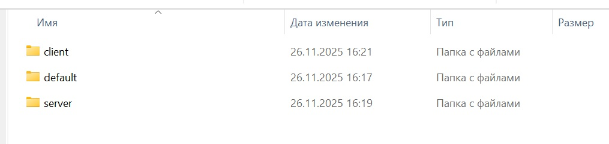
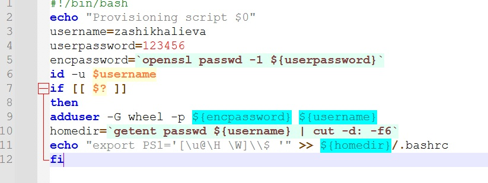
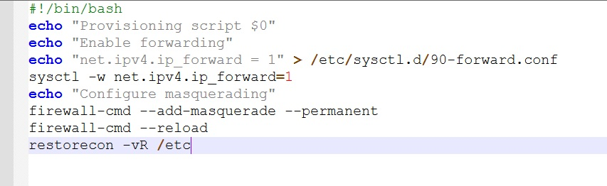

# Лабораторная работа №1  
**Тема:** Подготовка лабораторного стенда  
**Исполнитель:** Шихалиева Зурият Арсеновна  
**Учебное заведение:** Российский университет дружбы народов  

## Цель работы
Приобрести практические навыки установки Rocky Linux на виртуальную машину с помощью инструмента Vagrant.

## Задачи
- сформировать бокс‑файл с дистрибутивом Rocky Linux;
- запустить виртуальные машины сервера и клиента;
- внести изменения в настройки загрузки образов;
- добавить пользователя с правами администратора;
- изменить название хостов;
- скопировать необходимые файлы на внешний носитель.
- 

## Ход выполнения работы

1. **Подготовка структуры каталогов**  
   - В ОС Windows создан каталог для проекта.  
   - В каталог помещён образ Rocky Linux и файлы, необходимые для работы с Vagrant.  
   - Создан подкаталог `provision` с вложенными каталогами:  
     - `default`;  
     - `server`;  
     - `client`.

   

2. **Размещение скриптов в каталогах**  
   - В каталоге `default` размещены скрипты:  
     - `01-user.sh` — для изменения названия виртуальной машины;  
     - `01-hostname.sh` — для изменения имени хоста.  

     
     
   


   - В каталоге `server` размещён скрипт `02-forward.sh` для настройки виртуальной машины.

   

3. **Регистрация образа в Vagrant**  
   - В терминале, находясь в каталоге проекта, выполнена регистрация образа виртуальной машины в Vagrant.

   


4. **Запуск виртуальных машин**  
   - Выполнены команды:  
     ```bash
     vagrant up server
     vagrant up client
     ```  
   - Убедиться в успешном запуске обеих ВМ: выполнен вход под пользователем `vagrant` с паролем `vagrant`.

   


5. **Внесение изменений во внутреннее окружение**  
   - Зафиксированы изменения настроек ВМ командами:  
     ```bash
     vagrant up server --provision
     vagrant up client --provision
     ```

   


6. **Проверка настроек и авторизации**  
   - Выполнен вход на сервер и клиент под созданным пользователем.  
   - Проверено отображение приглашения в терминале:  
     - на сервере: `user@server.user.net`;  
     - на клиенте: `user@client.user.net`  
     (где `user` — логин исполнителя: `dmbelicheva`).


## Выводы
В процессе выполнения лабораторной работы приобретены практические навыки:
- установки Rocky Linux на виртуальную машину;
- работы с инструментом Vagrant;
- настройки виртуальных машин (изменение имён хостов, создание пользователей, применение скриптов конфигурации).


Работа выполнена в полном объёме, все поставленные задачи решены.
